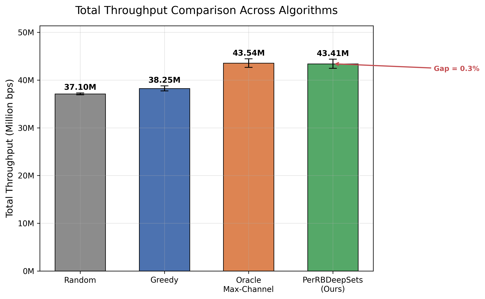
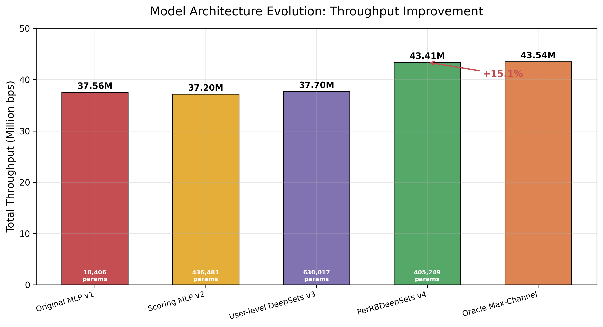
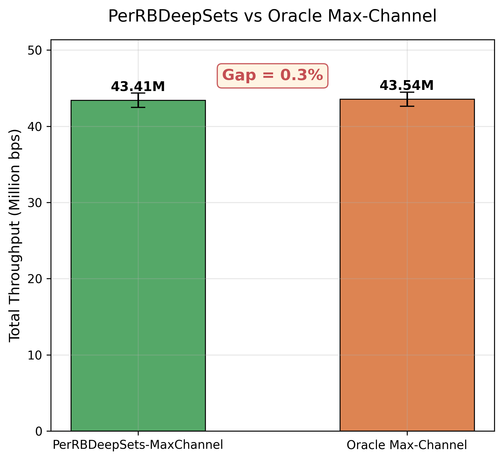
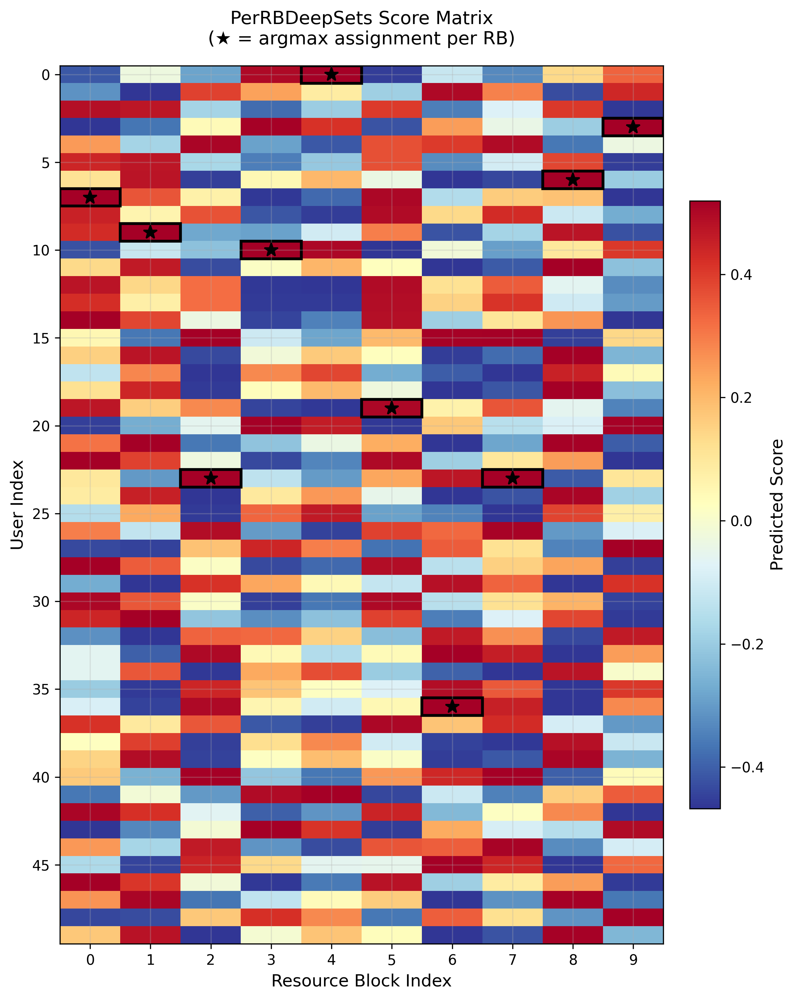
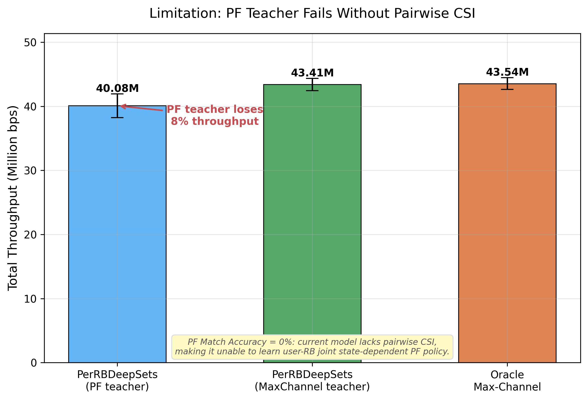

# AI6G-SpectrumSim

基于 **PerRBDeepSets** 的轻量级 AI 原生 6G 频谱资源分配仿真框架。PerRBDeepSets 是一种神经网络调度器，通过从启发式教师算法中学习，实现对每个"用户—资源块"组合的独立评分。

[English](README.md)

## 动机

在 6G AI 原生网络中，智能资源调度需要平衡吞吐量、公平性和需求满足率。本项目探索小型神经网络能否学习复现经典启发式调度算法，甚至加以改进。

PerRBDeepSets 将调度问题分解为逐资源块（per-RB）的分配决策，使网络结构与问题结构相匹配，而非将调度视为单一的端到端优化问题。

## 主要特性

- **PerRBDeepSets 模型**：逐用户逐 RB 的成对评分，独立的用户/RB 编码器（405K 参数）
- **多种基线算法**：Random、Max-Channel、Greedy、WeightedGreedy、DemandAwarePF
- **知识蒸馏**：从启发式教师算法训练神经调度器
- **多种子评估**：可配置随机种子，保证统计稳健性
- **混合教师扫描**：在 Max-Channel 和 DemandAwarePF 目标之间插值
- **可复现**：固定种子、确定性数据生成与评估

## 安装

```bash
# 克隆仓库
git clone https://github.com/your-username/AI6G-SpectrumSim.git
cd AI6G-SpectrumSim

# 安装依赖（推荐 Python >= 3.8）
pip install -r requirements.txt

# 或使用 conda
conda env create -f environment.yml
conda activate ai6g
```

### 依赖

- Python >= 3.8
- NumPy >= 1.21
- PyTorch >= 1.9
- Matplotlib >= 3.4

## 快速开始

```bash
# 运行默认实验（PerRBDeepSets + Max-Channel，5 个种子）
python main.py

# 单种子快速测试（CPU 约 2-5 分钟）
python main.py --seeds 0 --epochs 50
```

## 复现最终实验

主实验使用 PerRBDeepSets，在 Max-Channel 教师监督下，跨 5 个随机种子训练：

```bash
python main.py --model_type per_rb_deepsets --teacher max_channel --epochs 300 --seeds 0 1 2 3 4
```

**预期运行时间**：CPU 约 15-30 分钟（取决于硬件）。如有 GPU 会自动使用。

### 预期结果

| 算法 | 总吞吐量 | 被服务用户公平性 | 全部用户公平性 | 需求满足率 |
|------|---------|----------------|--------------|----------|
| Random | 37.10M ± 0.20M | 0.930 | — | 0.141 |
| **Max-Channel（oracle）** | **43.54M ± 0.91M** | 0.749 | — | 0.030 |
| Greedy | 38.25M ± 0.52M | 0.999 | — | 0.353 |
| WeightedGreedy | 37.61M ± 0.42M | 0.811 | — | 0.081 |
| DemandAwarePF | 37.84M ± 0.91M | 0.829 | — | 0.075 |
| **PerRBDeepSets** | **43.41M ± 0.95M** | **1.000** | — | 0.017 |

> **注意**："被服务用户公平性"仅统计获得至少一个 RB 的用户，"全部用户公平性"则将未服务用户的吞吐量记为 0 后在所有用户上计算。详见 [docs/metrics.md](docs/metrics.md)。

PerRBDeepSets 对每个"用户—资源块"组合输出独立评分矩阵，并逐资源块完成分配。在 Max-Channel teacher 监督下，该模型仅使用 405K 参数即可达到 43.41M ± 0.95M 的总吞吐量，距离 oracle Max-Channel 的 43.54M 仅相差约 0.3%。相比旧版用户级 DeepSets 的 37.7M，吞吐量提升约 15.1%。这说明，在智能资源调度任务中，合理匹配问题结构的网络设计比单纯增加模型参数更重要。

## 模型架构

### PerRBDeepSets（最佳模型，405,249 参数）

```
用户编码器:  Input(12) → [Linear(256) → BN → GELU → Dropout → Linear(256) → BN → GELU → Dropout]
RB 编码器:   Input(2)  → [Linear(64) → BN → GELU → Linear(64) → BN → GELU]
成对评分:    concat(用户嵌入[256], RB嵌入[64]) = [320]
             → [512 → BN → GELU → Dropout → 256 → BN → GELU → Dropout → 128 → BN → GELU → Dropout → 1]
输出:        [用户数 × RB数] 评分矩阵 → 每列 argmax（每个 RB 选择最优用户）
```

### 其他模型

| 模型 | 输入 | 输出 | 参数量 |
|------|------|------|--------|
| ScoringMLP | 用户特征 (12) | 每用户评分 | ~436K |
| DeepSetScheduler | 用户特征 (12) | 每用户评分（含全局上下文） | ~630K |
| **PerRBDeepSets** | 用户特征 (12) + RB 特征 (2) | 每用户每 RB 评分矩阵 | **~405K** |

### 训练配置

- **损失函数**: SmoothL1 + λ_rank × Pairwise Ranking Loss（λ_rank = 0.1）
- **教师算法**: max_channel / demandaware_pf / hybrid
- **优化器**: AdamW + CosineAnnealingLR（η_min = 0.01 × lr）
- **正则化**: 梯度裁剪 (max_norm=1.0)、Dropout (0.1)、早停 (patience=30)

## 对比算法

| 算法 | 策略 |
|------|------|
| **Random** | 每个 RB 随机分配用户 |
| **Max-Channel** | 每个 RB 选择最佳 SNR 用户（最大吞吐量 oracle） |
| **Greedy** | SNR × 需求评分 |
| **WeightedGreedy** | α·SNR + β·需求 + γ·公平性 − δ·历史吞吐 |
| **DemandAwarePF** | rate × (1 + λ·需求) / (历史吞吐 + ε)^β（比例公平） |
| **PerRBDeepSets** | 学习型逐用户逐 RB 评分（神经网络） |

## 核心结果（图表）

### 吞吐量对比



*PerRBDeepSets 的总吞吐量达到 43.41M，仅比 oracle Max-Channel（43.54M）低约 0.3%。*

### 模型架构演进



*从扁平 MLP 到逐用户逐 RB 评分架构，吞吐量提升 15.1%（37.56M → 43.41M），参数量反而少于 User-level DeepSets。这说明合理匹配问题结构的网络设计比单纯增加参数更重要。*

### Oracle Gap 分析



*PerRBDeepSets 在 Max-Channel 教师监督下能够有效逼近逐资源块最优分配策略，差距仅约 0.3%。*

### 逐 RB 评分热力图



*模型输出 [用户数 × RB数] 评分矩阵，每个 RB 分配给评分最高的用户（用 ★ 标记）。*

### 为什么 PerRBDeepSets 比旧 DeepSets 明显提升

旧版 DeepSets 只输出每个用户的单一评分（全局上下文），所有 RB 共享同一个用户排序。PerRBDeepSets 为每个"用户—RB"对独立评分，从而能够学习每个 RB 上不同的最优用户选择，这与 Max-Channel 教师策略的逐 RB argmax 结构完全匹配。

### 为什么接近 Max-Channel

Max-Channel 教师策略本质上是"每个 RB 选择信道最好的用户"，即逐 RB 的 argmax 操作。PerRBDeepSets 的 per-user-per-RB 评分架构恰好与这个结构一致，因此教师信号容易学习，match accuracy 高（均值约 0.78，seed=3 达到 1.00）。

### 为什么 PF Teacher 仍然失败



*DemandAwarePF 教师的 match accuracy 为 0%，因为 PF 策略依赖用户—资源块的联合信道状态（pairwise CSI），而当前模型输入仅包含用户全局特征，缺少逐 RB 信道信息。PerRBDeepSets 在 PF 教师下吞吐量仅约 40.08M，明显低于 Max-Channel 教师的 43.41M。*

### 下一步：加入 pairwise CSI

要使 PF teacher 成功，需要在输入特征中加入每个用户在每个 RB 上的信道质量信息（如 SNR），使模型能够表达用户—资源块联合状态。

### 全部图表

运行 `python scripts/plot_results.py` 后，所有图表保存在 `results/figures/`：

| 图表 | 说明 |
|------|------|
| `throughput_comparison_final.png` | 各算法总吞吐量对比 |
| `model_evolution.png` | 模型迭代提升 |
| `oracle_gap.png` | PerRBDeepSets 与 Oracle 差距 |
| `multi_metric_radar_or_bar.png` | 多指标分组柱状图 |
| `teacher_match_accuracy.png` | 逐种子教师匹配准确率 |
| `per_rb_score_heatmap.png` | 评分矩阵热力图 |
| `allocation_heatmap_final.png` | 用户-RB 分配热力图 |
| `limitation_pf_teacher.png` | PF 教师失败分析 |

## 项目结构

```
AI6G-SpectrumSim/
├── main.py                  # 入口文件
├── src/
│   ├── environment.py       # 频谱仿真环境
│   ├── algorithms.py        # 启发式调度算法
│   ├── mlp_model.py         # 神经网络模型
│   ├── train.py             # 训练与评估逻辑
│   └── visualization.py     # 绘图工具
├── scripts/                 # 实验运行脚本
├── configs/                 # YAML 配置文件
├── results/                 # 实验输出
│   ├── final/               # 预计算的参考结果
│   └── figures/             # 参考图表
├── docs/                    # 文档
├── tests/                   # 单元测试
├── requirements.txt
├── pyproject.toml
└── environment.yml
```

## 局限性

- **小规模仿真**：50 个用户、10 个 RB、100m × 100m 区域，远未达到真实 6G 场景规模
- **简化信道模型**：对数距离路损 + 高斯衰落，未考虑 MIMO/mmWave/NLOS 效应
- **单小区**：无小区间干扰建模
- **无逐 RB CSI 输入**：用户特征不包含逐 RB 信道状态信息。PF 教师的 match accuracy 为 0%，证实当前模型缺少 pairwise CSI 来学习依赖用户—资源块联合状态的 PF 策略
- **静态分配**：无时序调度或多时隙优化
- **公平性指标注意**："被服务用户公平性"仅统计获得至少一个 RB 的用户，当少量用户被服务时可能产生误导

## 未来工作

- 增加逐 RB CSI 作为输入特征，提升 DemandAwarePF 教师学习效果
- 扩展到更大规模场景（更多用户、RB、多小区）
- 实现时序/多时隙调度
- 探索强化学习方法进行多目标优化
- 增加 MIMO 和波束赋形支持
- 研究跨场景规模的迁移学习

## 引用

如果您使用了本仓库，请引用：

> AI6G-SpectrumSim: A lightweight AI-native 6G spectrum allocation simulation with PerRBDeepSets. https://github.com/your-username/AI6G-SpectrumSim

## 许可证

本项目采用 [MIT 许可证](LICENSE) 授权。
