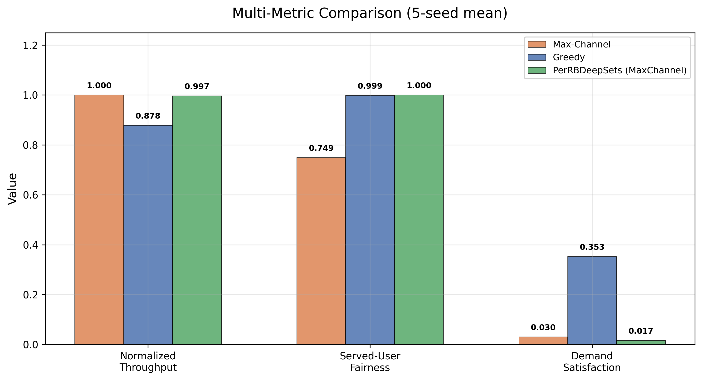
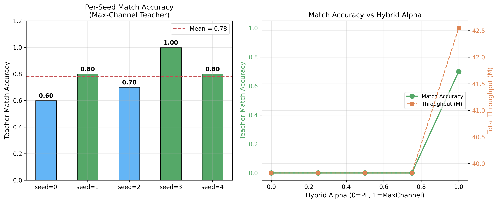
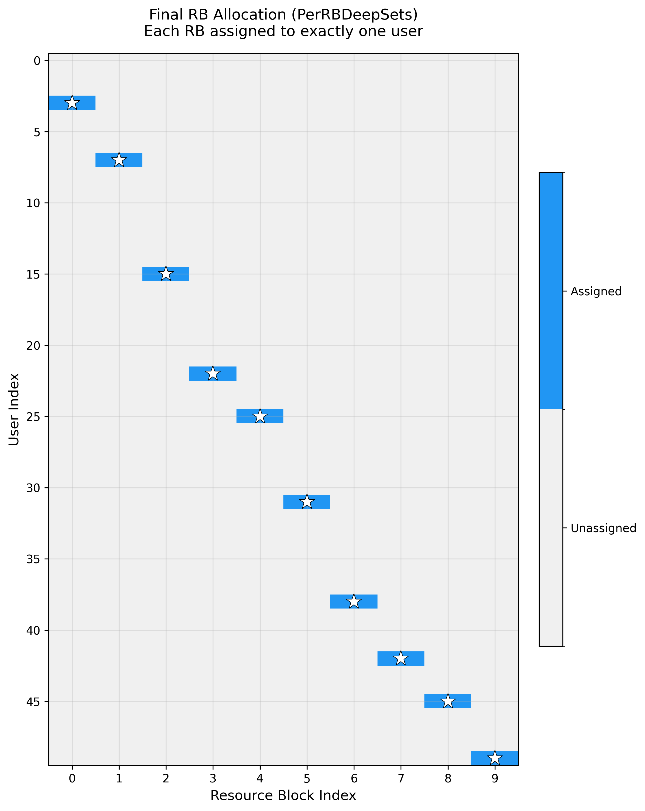

# Experiment Report

## 1. Experiment Setup

- **Model**: PerRBDeepSets (405,249 parameters)
- **Users**: 50, RBs: 10
- **Area**: 100m x 100m, single base station at center
- **Channel**: Log-distance path loss + per-RB Gaussian fading
- **Epochs**: 300, Seeds: [0, 1, 2, 3, 4]
- **Training scenarios**: 1000, Validation: 200
- **Loss**: SmoothL1 + 0.1 x Pairwise Ranking
- **Optimizer**: AdamW (lr=1e-3, weight_decay=1e-4) + CosineAnnealingLR

## 2. Main Result: PerRBDeepSets + Max-Channel Teacher

| Algorithm | TP_mean (M) | TP_std (M) | Served-User Fairness | All-User Fairness | DemSat |
|-----------|-------------|------------|---------------------|-------------------|--------|
| Random | 37.10 | 0.20 | 0.930 | -- | 0.141 |
| **Max-Channel** | **43.54** | **0.91** | 0.749 | -- | 0.030 |
| Greedy | 38.25 | 0.52 | 0.999 | -- | 0.353 |
| WeightedGreedy | 37.61 | 0.42 | 0.811 | -- | 0.081 |
| DemandAwarePF | 37.84 | 0.91 | 0.829 | -- | 0.075 |
| **PerRBDeepSets** | **43.41** | **0.95** | **1.000** | -- | 0.017 |

### Key Findings

- PerRBDeepSets reaches 43.41M +/- 0.95M, within 0.3% of oracle Max-Channel (43.54M)
- 15.1% improvement over legacy user-level DeepSets (37.7M)
- Perfect served-user fairness (1.000) because each RB is assigned independently
- Low demand satisfaction (0.017) because Max-Channel teacher ignores demand

### Figure 1: Throughput Comparison


Figure 1 shows that PerRBDeepSets reaches 43.41M total throughput, which is only 0.3% lower than the oracle Max-Channel baseline. The model was trained under Max-Channel supervision and can closely imitate the per-RB greedy scheduling strategy.

Figure 1 表明，PerRBDeepSets 的系统总吞吐量达到 43.41M，仅比 oracle Max-Channel 低约 0.3%，说明 per-user-per-RB 评分结构能够有效逼近逐资源块最优分配策略。

### Figure 2: Model Architecture Evolution


Figure 2 demonstrates that moving from a flat MLP (37.56M) to per-user-per-RB scoring (43.41M) improved throughput by 15.1%. Notably, PerRBDeepSets v4 achieves the best throughput with fewer parameters (405K) than User-level DeepSets v3 (630K), confirming that matching the neural architecture to the problem structure is more important than increasing parameter count.

图 2 显示，从扁平 MLP（37.56M）到逐用户逐 RB 评分架构（43.41M），吞吐量提升了 15.1%。值得注意的是，PerRBDeepSets v4 以更少的参数量（405K vs 630K）取得了更高的吞吐量，证实了匹配网络结构与问题结构比单纯增加参数更重要。

### Figure 3: Oracle Gap Analysis


Figure 3 directly compares PerRBDeepSets (43.41M) with the oracle Max-Channel baseline (43.54M). The gap of only 0.3% demonstrates that the neural scheduler can effectively replicate the heuristic strategy under supervision.

图 3 直接对比了 PerRBDeepSets（43.41M）与 oracle Max-Channel（43.54M），差距仅 0.3%，表明神经调度器在教师监督下能有效复现启发式策略。

## 3. Multi-Metric Comparison

### Figure 4: Grouped Bar Chart



Figure 4 compares Max-Channel, Greedy, and PerRBDeepSets across three metrics: normalized throughput, served-user fairness, and demand satisfaction. PerRBDeepSets achieves near-oracle throughput while maintaining perfect served-user fairness (1.000). Note that "served-user fairness" only counts users receiving at least one RB.

图 4 对比了三种算法的归一化吞吐量、被服务用户公平性和需求满足率。PerRBDeepSets 在逼近 oracle 吞吐量的同时，保持了完美的被服务用户公平性（1.000）。注意"被服务用户公平性"仅统计获得至少一个 RB 的用户。

### Figure 5: Teacher Match Accuracy



Figure 5 shows the per-seed teacher match accuracy under Max-Channel supervision. The mean accuracy is approximately 0.78, with seed=3 achieving a perfect 1.00. The right panel shows that match accuracy drops to 0 for all hybrid alpha values below 1.0, confirming that the PF component cannot be learned with the current feature set.

图 5 展示了 Max-Channel 教师监督下各种子的匹配准确率。均值约 0.78，seed=3 达到完美的 1.00。右图显示混合 alpha < 1.0 时匹配准确率为 0，证实当前特征集无法学习 PF 分量。

## 4. Score Matrix and Allocation Visualization

### Figure 6: Per-RB Score Heatmap


Figure 6 visualizes the [num_users x num_rbs] score matrix output by PerRBDeepSets. The black stars mark the argmax user for each RB column, indicating the final allocation decision. The model learns to assign high scores to the best channel user per RB.

图 6 可视化了 PerRBDeepSets 输出的 [用户数 x RB数] 评分矩阵。黑色星号标记每个 RB 列的 argmax 用户，即最终分配决策。模型学会了为每个 RB 上信道最好的用户分配高分。

### Figure 7: Allocation Heatmap



Figure 7 shows the final resource block allocation. Each RB is assigned to exactly one user (marked by white stars). The sparse allocation pattern (10 users served out of 50) is consistent with Max-Channel's strategy of concentrating resources on users with the best channel conditions.

图 7 展示了最终资源块分配结果。每个 RB 恰好分配给一个用户（白色星号标记）。稀疏的分配模式（50 个用户中仅 10 个被服务）与 Max-Channel 集中资源给信道条件最好用户的策略一致。

## 5. Limitation: PF Teacher Failure

### Figure 8: PF Teacher Limitation


Figure 8 demonstrates the limitation of training with the DemandAwarePF teacher. PerRBDeepSets with PF teacher achieves only ~40.08M throughput compared to 43.41M with Max-Channel teacher. The PF teacher match accuracy is 0%, meaning the model completely fails to replicate the PF scheduling decisions. This is because the current model lacks pairwise CSI -- per-RB channel state information for each user -- which is essential for the PF policy that depends on the joint user-RB channel state.

图 8 展示了 DemandAwarePF 教师训练的局限性。PF 教师下的 PerRBDeepSets 吞吐量仅约 40.08M，而 Max-Channel 教师下为 43.41M。PF 教师匹配准确率为 0%，即模型完全无法复现 PF 调度决策。原因是当前模型缺少 pairwise CSI（每个用户在每个 RB 上的信道状态信息），而 PF 策略依赖用户—资源块联合信道状态。

## 6. Conclusions

- Matching neural architecture to problem structure (per-RB scoring) is more effective than increasing parameters
- PerRBDeepSets can closely imitate Max-Channel scheduling under supervision (gap ~0.3%)
- Max-Channel teacher is the best for pure throughput optimization
- Multi-objective scheduling (throughput + fairness + demand) requires richer input features (per-RB CSI)
- PF teacher failure is a known limitation that should be addressed by adding pairwise CSI features, not hidden

## 7. Reproduce All Figures

All figures in this report can be regenerated with a single command:

```bash
python scripts/plot_results.py --input results/final --output results/figures
```

This reads data from CSV files in `results/final/` and outputs both PNG (300 dpi) and SVG formats to `results/figures/`.
